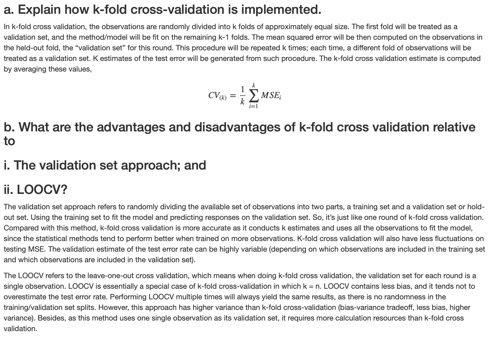

# 
ISL Exercises and Solutions

## Chapter 2
### 1. For each of parts (a) through (d), indicate whether we would generally expect the performance of a flexible statistical learning method to be better or worse than an inflexible method. Justify your answer.
### (a) The sample size n is extremely large, and the number of predictors p is small.
Better. As the sample size is extremely large, a flexible method would fit data better and perform better than an inflexible approach.

### (b) The number of predictors p is extremely large, and the number of observations n is small.
Worse.  A felxible method is tend to overfit the small number of observations.

### (c) The relationship between the predictors and response is highly non-linear.
Better. With more degrees of freedom, a flexible method would fit the data better than an inflexible one.

### (d) The variance of the error terms, i.e. σ2 = Var(ε), is extremely high.
（attempted answer）

Better. Var(ε) is extremely high means the data is very complicated. Thus a flexible model can fit the data batter.

### 2. Explain whether each scenario is a classification or regression prob- lem, and indicate whether we are most interested in inference or pre- diction. Finally, provide n and p.
### (a) We collect a set of data on the top 500 firms in the US. For each firm we record profit, number of employees, industry and the CEO salary. We are interested in understanding which factors affect CEO salary.
Regression and inference with n = 500 and p = 3.

### (b) We are considering launching a new product and wish to know whether it will be a success or a failure. We collect data on 20 similar products that were previously launched. For each product we have recorded whether it was a success or failure, price charged for the product, marketing budget, competition price, and ten other variables.
Classification and prediction with n = 20 and p = 13.

### (c) We are interested in predicting the % change in the USD/Euro exchange rate in relation to the weekly changes in the world stock markets. Hence we collect weekly data for all of 2012. For each week we record the % change in the USD/Euro, the % change in the US market, the % change in the British market, and the % change in the German market.
Regression and predicgtion with n = 52 and p = 3.

### 3. We now revisit the bias-variance decomposition.
### (a) Provide a sketch of typical (squared) bias, variance, training error, test error, and Bayes (or irreducible) error curves, on a single plot, as we go from less flexible statistical learning methods towards more flexible approaches. The x-axis should represent the amount of flexibility in the method, and the y-axis should represent the values for each curve. There should be five curves. Make sure to label each one.

The dashed line is $Var(\epsilon)$, i.e. irreducible errors.

### (b) Explain why each of the five curves has the shape displayed in part (a).

The training MSE declines monotonically as flexibility increases, this is because as flexibility increases the regression model fits the observed data more closely. 

The testing MSE intially declines as flexibility increases but at some point it levels off and then starts to increase again (U-shape), this is because when a regression model yields a small training MSE but a large testing MSE we are actually overfitting the data. 

The squared bias decreases monotonically and the variance increases monotonically. Generally, more flexible methods result in less bias, and as we use more flexible methods, the variance will increase and the bias will decrease. 

Variance refers to the amount by which estimated $f$ would change if we estimated it using a different training data set, so if the curve fits the observations very closely, changing any point may cause estimated $f$ to change considerably, and so will result in some variance. 

Bias refers to the error that is introduced by approximating a real-life problem by a much simpler model, so if we use a very simple model (linear regression) it is unlikely that any real-life problem has such a simple linear relationship, and so performing linear regression will result in some bias in the estimate of $f$. 

The irreducible error is a constant so it is a parallel line, this curve lies below the test MSE curve because the expected test MSE will always be greater the Var(ε).

### 4. You will now think of some real-life applications for statistical learning

### (a) Describe three real-life applications in which classification might be useful. Describe the response, as well as the predictors. Is the goal of each application inference or prediction? Explain your answer.

Classification 1:  
Is this TV series/movie/ad campaign going to be successful or not (Response : Success/Failure, Predictors : Money spent, Talent, Running Time, Producer, TV Channel, Air time slot, etc., Goal : Prediction). 

Classification 2:   
Should this applicant be admitted into Harvard University or not (Response : Admit/Not admit, Predictors : SAT Scores, GPA, Socio Economic Strata, Income of parents, Essay effectiveness, Potential, etc., Goal : Prediction). 

Classification 3: 
Salk Polio vaccine trials – Successful/Not Successful (Response : Did the child get polio or not, Predictors : Age, Geography, General health condition, Control/Test group, etc., Goal : Prediction).

### (b) Describe three real-life applications in which regression might be useful. Describe the response, as well as the predictors. Is the goal of each application inference or prediction? Explain your answer.

Regression 1: 
GDP Growth in European economies (Response : What is the GDP of countries predicted to be by 2050, Predictors : Population, Per capita income, Education, Average life expectancy, Tax Revenue, Government Spending etc., Goal : Inference). 

Regression 2: 
 What is the average house sale price in XXX neighborhood over the next 5 years (Response : Average house in XXX neighborhood will sell for Y next year, Z the year after, T after that, etc., Predictors : Proximity to transit, Parks, Schools, Average size of family, Average Income of Family, Crime Rate, Price Flux in surrounding neighborhoods etc., Goal : Inference). 

Regression 3:  
Gas mileage that a new car design will result in (Response : With certain parameters being set, X is the mileage we will get out of this car, Predictors: Fuel type, Number of Cylinders, Engine Version, etc., Goal : Inference).

### (c) Describe three real-life applications in which cluster analysis might be useful.

Cluster 1:  
Division of countries into Developed, Developing and Third World (Response : By 2050, countries in Asia can be split into these following clusters, Predictors : Per Capita Income, Purchasing power parity, Average birth rate, Average number of years of education received, Average Death Rate, Population etc., Goal: Prediction).

Cluster 2:  
Division of average working population into income segments for taxation purposes (Response : This worker falls under this taxation bracket, Predictors : Income, Job Industry, Job Segment, Size of Company, etc., Goal : Prediction). 

Cluster 3:  
Cluster new movies being produced into ratings G/PG/R/PG-13 etc. (Response : This movie is a R/PG/PG-13, Predictors : Violent content, Sexual language, theme, etc., Goal : Prediction).

### 5. What are the advantages and disadvantages of a very flexible (versus a less flexible) approach for regression or classification? Under what circumstances might a more flexible approach be preferred to a less flexible approach? When might a less flexible approach be preferred?

The advantages of a very flexible approach are that it may give a better fit for non-linear models and it decreases the bias.

The disadvantages of a very flexible approach are that it requires estimating a greater number of parameters, it might take the noises into consideration (overfitting) leading to large testing MSE and it increases the variance.

A more flexible approach would be preferred to a less flexible approach when we are interested in prediction and not the interpretability of the results.

A less flexible approach would be preferred to a more flexible approach when we are interested in inference and the interpretability of the results.

###6. Describe the differences between a parametric and a non-parametric statistical learning approach. What are the advantages of a parametric approach to regression or classification (as opposed to a non-arametric approach)? What are its disadvantages?

A parametric approach reduces the problem of estimating true $f$ down to one of estimating a set of parameters because it assumes a form for $f$.

A non-parametric approach does not assume a patricular form of $f$ and so requires a very large sample to accurately estimate true $f$.

The advantages of a parametric approach to regression or classification are the simplifying of modeling $f$ to a few parameters and not as many observations are required compared to a non-parametric approach.

The disadvantages of a parametric approach to regression or classification are a potentially inaccurate estimate $f$ if the form of $f$ assumed is wrong or to overfit the observations if more flexible models are used.

### 7. The table below provides a training data set containing six observations, three predictors, and one qualitative response variable.

Obs. | X1 | X2 | X3 | Y
:-: | :-: | :-: | :-: | :-: 
1 | 0 | 3 | 0 | Red
2 | 2 | 0 | 0 | Red
3 | 0 | 1 | 3 | Red
4 | 0 | 1 | 2 | Green 
5 | −1| 0 | 1 | Green 
6 | 1 | 1 | 1 | Red

### Suppose we wish to use this data set to make a prediction for Y when X1 = X2 = X3 = 0 using K-nearest neighbors.
### (a) Compute the Euclidean distance between each observation and the test point, X1 =X2 =X3 =0.

1. $\sqrt{(0-0)^2 + (0-3)^2 + (0-0)^2} = \sqrt{9} = 3$ 

2. $\sqrt{(0-2)^2 + (0-0)^2 + (0-0)^2}= \sqrt{4} = 2$

3. $\sqrt{(0-0)^2 + (0-1)^2 + (0-3)^2}= \sqrt{10} = 3.162278$

4. $\sqrt{(0-0)^2 + (0-1)^2 + (0-2)^2}= \sqrt{5}= 2.236068$

5. $\sqrt{(0+1)^2 + (0-0)^2 + (0-1)^2}= \sqrt{2} =1.414214$ 

6. $\sqrt{(0-1)^2 + (0-1)^2 + (0-1)^2}= \sqrt{3}=1.732051$

### (b) What is our prediction with K = 1? Why?
Green.

If K = 1, the most closet observation to the test point is Obs.5. The test point can be estimated to have the same label as Obs.5.
$$P(Y=Red|X=x_0)=\frac{1}{1}\sum I(y_i=Red)=I(y_5=Red)=0$$
$$P(Y=Green|X=x_0)=\frac{1}{1}\sum I(y_i=Green)=I(y_5=Green)=0$$
### (c) What is our prediction with K = 3? Why?
Red.

If K = 3, the most closet observations to the test point are Obs.5, Obs.6, Obs.2. According to majority vote, the test point can be estimated to have the same label as Obs.2 and Obs.6.
$$P(Y=Red|X=x_0)=\frac{1}{3}\sum I(y_i=Red)=\frac{1}{3}(1+0+1)=\frac{2}{3}$$
$$P(Y=Green|X=x_0)=\frac{1}{3}\sum I(y_i=Green)=\frac{1}{3}(0++01)=\frac{1}{3}$$
### (d) If the Bayes decision boundary in this problem is highly non- linear, then would we expect the best value for K to be large or small? Why?

> As K grows, the method becomes less flexible and produces a decision boundary that is close to linear. 

Thus, under this situation, K should be expected to be small.

## Chapter 3
### 1. Describe the null hypotheses to which the p-values given in Table 3.4 correspond. Explain what conclusions you can draw based on these p-values. Your explanation should be phrased in terms of sales, TV, radio, and newspaper, rather than in terms of the coefficients of the linear model.
The null hypotheses associated with table 3.4 are that advertising budgets of “TV”, “radio” or “newspaper” do not have an effect on sales. More precisely,
$$H_0^1:\beta_1=0$$
$$H_0^2:\beta_2=0$$
$$H_0^3:\beta_3=0$$
The corresponding p-values are highly significant for “TV” and “radio” and not significant for “newspaper”. So we reject $H_0^1$ and $H_0^2$, but we fail to reject $H_0^3$. We may conclude that newspaper advertising budget does not affect sales.

### 2. Carefully explain the differences between the KNN classifier and KNN regression methods.
The KNN classifier is typically used to solve classification problems (those with a qualitative response) by identifying the neighborhood of $x_0$ and then estimating the conditional probability $P(Y=j|X=x_0)$ for class j as the fraction of points in the neighborhood whose response values equal j. 

The KNN regression method is used to solve regression problems (those with a quantitative response) by again identifying the neighborhood of $x_0$ and then estimating $f(x_0)$ as the average of all the training responses in the neighborhood.

### 3. Suppose we have a data set with five predictors,  X1 = GPA,  X2 = IQ,  X3 = Gender (1 for Female and 0 for Male),  X4 = Interaction between GPA and IQ,  X5 = Interaction between GPA and Gender.  The response is starting salary after graduation (in thousands of dollars).  Suppose we use least squares to fit the model, and get $\hat{\beta_0}$ = 50, $\hat{\beta_1}$ = 20, $\hat{\beta_2}$ = 0.07, $\hat{\beta_3}$= 35, $\hat{\beta_4}$= 0.01, $\hat{\beta_5}$ = −10. (a) Which answer is correct, and why?  i. For a fixed value of IQ and GPA,males earn more on average than females.  ii. For a fixed value of IQ and GPA, females earn more on average than males. iii. For a fixed value of IQ and GPA, males earn more on average than females provided that the GPA is high enough. iv. For a fixed value of IQ and GPA, females earn more on average than males provided that the GPA is high enough.

$$\hat{y} = 50+20GPA+0.07IQ+35Gender+0.01GPA×IQ−10GPA×Gender\\=
\begin{cases}
\hat{y}=50+20GPA+0.07IQ+0.01GPA×IQ& &if\ this\ person\ is\ male\\
\hat{y}=85+10GPA+0.07IQ+0.01GPA×IQ& &if\ this\ person\ is\ female\\
\end{cases}$$
So the starting salary for males is higher than for females on average iff $50+20GPA≥85+10GPA$ which is equivalent to $GPA≥3.5$. Therefore iii. is the right answer.

### (b) Predict the salary of a female with IQ of 110 and a GPA of 4.0.
$$\hat{y}=85+40+7.7+4.4=137.1$$
i.e. 137,100 dollars.

### (c) True or false: Since the coefficient for the GPA/IQ interaction term is very small, there is very little evidence of an interaction effect. Justify your answer.
False. To verify if the interaction between GPA and IQ has an impact on the quality of the model we need to test the hypothesis $H_0:\hat{\beta}_4=0$ and look at the p-value associated with the t or the F statistic to draw a conclusion. If the p-value is significant enough, we can then reject $H_0$.

### 4. I collect a set of data (n = 100 observations) containing a single predictor and a quantitative response. I then fit a linear regression model to the data, as well as a separate cubic regression, i.e. Y = β0 +β1X +β2X2 +β3X3+ε.
### (a) Suppose that the true relationship between X and Y is linear, i.e. Y = β0 +β1X + ε. Consider the training residual sum of squares (RSS) for the linear regression, and also the training RSS for the cubic regression. Would we expect one to be lower than the other, would we expect them to be the same, or is there not enough information to tell? Justify your answer.
（attempted answer）

I would say there is not enough information to tell. As there is no obvious evidence that can indicate whether the polynomial terms can help explain the variation of ε or not.

### (b) Answer (a) using test rather than training RSS.
In this case the testing RSS depends upon the test data, so we have not enough information to conclude. However, we may assume that polynomial regression will have a higher test RSS as the overfit from training would have more error than the linear regression.

###(c) Suppose that the true relationship between X and Y is not linear, but we don’t know how far it is from linear. Consider the training RSS for the linear regression, and also the training RSS for the cubic regression. Would we expect one to be lower than the other, would we expect them to be the same, or is there not enough information to tell? Justify your answer.
Polynomial regression has lower training RSS than the linear fit because of higher flexibility: no matter what the underlying true relationshop is the more flexible model will closer follow points and reduce training RSS.

###(d) Answer (c) using test rather than training RSS.
There is not enough information to tell which testinf RSS would be lower for either regression given the problem statement is defined as not knowing “how far it is from linear”. If it is closer to linear than cubic, the linear regression testing RSS could be lower than the cubic regression testing RSS. Or, if it is closer to cubic than linear, the cubic regression test RSS could be lower than the linear regression testing RSS. It is due to bias-variance trade-off: it is not clear what level of flexibility will fit data better.

### 5.
Directly plug in the given terms and then calculate.

### 6. Using (3.4), argue that in the case of simple linear regression, the least squares line always passes through the point $(\bar{x}, \bar{y})$.
According to (3.4), $\hat{\beta_0}=\bar{y}-\hat{\beta_1}\bar{x}$.
$$y = \hat{\beta_0} + \hat{\beta_1}\bar{x} = \bar{y}-\hat{\beta_1}\bar{x} + \hat{\beta_1}\bar{x} = \bar{y}$$

###7. It is claimed in the text that in the case of simple linear regression of Y onto X, the R2 statistic (3.17) is equal to the square of the correlation between X and Y (3.18). Prove that this is the case. For simplicity, you may assume that $\bar{x}$ = $\bar{y}$ = 0.

## Chapter 4
### 1. Using a little bit of algebra, prove that (4.2) is equivalent to (4.3). In other words, the logistic function representation and logit represen- tation for the logistic regression model are equivalent.
$$p(X) = \frac{e^{\beta_0 + \beta_1X}}{1 + e^{\beta_0 + \beta_1X}}$$
$$p(X) + p(X)e^{\beta_0 + \beta_1X} = e^{\beta_0 + \beta_1X}$$
$$p(X) = (1 - p(X))e^{\beta_0 + \beta_1X}$$
$$\frac{p(X)}{1 - p(X)} = e^{\beta_0 + \beta_1X}$$

### 2. It was stated in the text that classifying an observation to the class for which (4.12) is largest is equivalent to classifying an observation to the class for which (4.13) is largest. Prove that this is the case. In other words, under the assumption that the observations in the kth class are drawn from a N(μk,σ2) distribution, the Bayes’ classifier assigns an observation to the class for which the discriminant function is maximized.

### 3. This problem relates to the QDA model, in which the observations within each class are drawn from a normal distribution with a class- specific mean vector and a class specific covariance matrix. We con- sider the simple case where p = 1; i.e. there is only one feature. Suppose that we have K classes, and that if an observation belongs to the kth class then X comes from a one-dimensional normal dis- tribution, X∼N(μk,σ2). Recall that the density function for the one-dimensional normal distribution is given in (4.11). Prove that in this case, the Bayes’ classifier is not linear. Argue that it is in fact quadratic.
Hint: For this problem, you should follow the arguments laid out in Section 4.4.2, but without making the assumption that σ12 = . . . = σK2.

If we proceed exactly as in the previous answer, we may see that finding k for which $p_k(x)$ is largest is equivalent to finding k for which (third equation in the previous answer) is largest. This last expression is obviously not linear in $x$.

### 4.  When the number of features p is large, there tends to be a deterioration in the performance of KNN and other local approaches that perform prediction using only observations that are near the test observation for which a prediction must be made. This phenomenon is known as the curse of dimensionality, and it ties into the fact that non-parametric approaches often perform poorly when p is large. We will now investigate this curse.
### (a) Suppose that we have a set of observations, each with measurements on p = 1 feature, X. We assume that X is uniformly (evenly) distributed on [0, 1]. Associated with each observation is a response value. Suppose that we wish to predict a test observation’s response using only observations that are within 10% of the range of X closest to that test observation. For instance, in order to predict the response for a test observation with X = 0.6, we will use observations in the range [0.55,0.65]. On average, what fraction of the available observations will we use to make the prediction?
It is clear that if $x ∈ [0.05,0.95]$ then the observations we will use are in the interval $[x−0.05,x+0.05]$ and consequently represents a length of 0.1 which represents a fraction of 10%. If $x < 0.05$, then we will use observations in the interval $[0,x+0.05]$cwhich represents a fraction of $(100x+5)%$; by a similar argument we conclude that if $x > 0.95$, then the fraction of observations we will use is $(105−100x)%$. To compute the average fraction we will use to make the prediction we have to evaluate the following expression
$$\int_0^{0.05} (100x+5)dx + \int_{0.05}^{0.95} 10dx + \int_{0.95}^1 (105-100x)dx = 9+0.375+0.375=9.75$$
So we may conclude that, on average, the fraction of available observations we will use to make the prediction is 9.75%.

### (b) Now suppose that we have a set of observations, each with measurements on p = 2 features, X1 and X2. We assume that (X1, X2) are uniformly distributed on [0,1]×[0,1]. We wish to predict a test observation’s response using only observations that are within 10 % of the range of X1 and within 10% of the range of X2 closest to that test observation. For instance, in order to predict the response for a test observation with X1 = 0.6 and X2 = 0.35, we will use observations in the range [0.55, 0.65] for X1 and in the range [0.3, 0.4] for X2. On average, what fraction of the available observations will we use to make the prediction?
If we assume $X_1$ and $X_2$ to be independant, the fraction of available observations we will use to make the prediction is 9.75% × 9.75% = 0.950625%.

### (c) Now suppose that we have a set of observations on p = 100 features. Again the observations are uniformly distributed on each feature, and again each feature ranges in value from 0 to 1. We wish to predict a test observation’s response using observations within the 10% of each feature’s range that is closest to that test observation. What fraction of the available observations will we use to make the prediction?
With the same argument than (a) and (b), we may conclude that the fraction of available observations we will use to make the prediction is $9.75\% ^ {100}$ ≃ 0%.

### (d) Using your answers to parts (a)–(c), argue that a drawback of KNN when p is large is that there are very few training observations “near” any given test observation.
As we saw in (a)-(c), the fraction of available observations we will use to make the prediction is $(9.75\%) ^ p$ with p
 the number of features. So when p→∞, we have
 $$\lim_{p→∞} = (9.75\%) ^ p = 0$$

###(e) Now suppose that we wish to make a prediction for a test observation by creating a p-dimensional hypercube centered around the test observation that contains, on average, 10% of the training observations. For p = 1,2, and 100, what is the length of each side of the hypercube? Comment on your answer.
For p=1, we have $l = 0.1$. 

For p=2, we have $l = 0.1^{1/2}$.

For p=100, we have $l = 0.1^{1/100}$.

### 5. We now examine the differences between LDA and QDA.
### (a) If the Bayes decision boundary is linear, do we expect LDA or QDA to perform better on the training set? On the test set?
If the Bayes decision boundary is linear, we expect LDA to perform better on the training set because its can yield a closer fit. QDA will generate a quadratic boundary. On the test set, we expect LDA to perform better than QDA, because QDA could overfit the linearity on the Bayes decision boundary.

### (b) If the Bayes decision boundary is non-linear, do we expect LDA or QDA to perform better on the training set? On the test set?
If the Bayes decision bounary is non-linear, we expect QDA to perform better both on the training and test sets.

### (c) In general, as the sample size n increases, do we expect the test prediction accuracy of QDA relative to LDA to improve, decline, or be unchanged? Why?
We expect the test prediction accuracy of QDA relative to LDA to improve, in general, as the the sample size $n$ increases because a more flexibile method will yield a better fit as more samples can be fit and variance is offset by the larger sample sizes.

### (d) True or False: Even if the Bayes decision boundary for a given problem is linear, we will probably achieve a superior test error rate using QDA rather than LDA because QDA is flexible enough to model a linear decision boundary. Justify your answer.
False. With fewer sample points, the variance from using a more flexible method such as QDA, may lead to overfit, which in turns may lead to an inferior test error rate.

### 6. Suppose we collect data for a group of students in a statistics class with variables X1 = hours studied, X2 = undergrad GPA, and Y = receive an A. We fit a logistic regression and produce estimated coefficient, $\hat{\beta_0}$ = -6, $\hat{\beta_1}$ = 0.05, $\hat{\beta_2}$ = 1.
### (a) Estimate the probability that a student who studies for 40h and has an undergrad GPA of 3.5 gets an A in the class.
$$p(X) = \frac{e^{\beta_0 + \beta_1X_1 + X_2}}{1 + e^{\beta_0 + \beta_1X_1+ X_2}}$$
$$p(X) = \frac{e^{-6 + 0.05X_1 + X_2}}{1 + e^{-6 + 0.05X_1 + X_2}} = 0.3775$$

### (b) How many hours would the student in part (a) need to study to have a 50% chance of getting an A in the class?
$$0.5 = \frac{e^{-6 + 0.05X_1 + X_2}}{1 + e^{-6 + 0.05X_1 + X_2}} = 0.3775$$
$$e^{-6 + 0.05X_1 + X_2} = 1$$
$$-6 + 0.05X_1 + 3.5 = 0$$
$$X_1 = 50$$

### 7. Suppose that we wish to predict whether a given stock will issue a dividend this year (“Yes” or “No”) based on X, last year’s percent profit. We examine a large number of companies and discover that the mean value of X for companies that issued a dividend was $\bar{X}$ = 10, while the mean for those that didn’t was $\bar{X}$ = 0. In addition, the variance of X for these two sets of companies was $\sigma^2$ = 36. Finally, 80% of companies issued dividends. Assuming that X follows a normal distribution, predict the probability that a company will issue a dividend this year given that its percentage profit was X = 4 last year.

### 8. Suppose that we take a data set, divide it into equally-sized training and test sets, and then try out two different classification procedures. First we use logistic regression and get an error rate of 20% on the training data and 30% on the test data. Next we use 1-nearest neighbors (i.e. K = 1) and get an average error rate (averaged over both test and training data sets) of 18%. Based on these results, which method should we prefer to use for classification of new observations? Why?

For KNN with K=1, the training error rate is 0% because for any training observation, its nearest neighbor will be the response itself. 
$$P(Y=j|X=x_i)=I(y_i=j)$$
We do not make any error on the training data within this setting, that explains the 0% training error rate. So, KNN has a test error rate of 36%. It is better to choose logistic regression because of its lower test error rate of 30%.

### 9. This problem has to do with odds.
### (a) On average, what fraction of people with an odds of 0.37 of defaulting on their credit card payment will in fact default?
$$\frac{p(X)}{1 - p(X)} = 0.37, p(X) = 0.27$$
So, we have on average a fraction of 27% of people defaulting on their credit card payment.

### (b) Suppose that an individual has a 16% chance of defaulting on her credit card payment. What are the odds that she will default?
$$\frac{p(X)}{1 - p(X)} = \frac{0.16}{1 - 0.16} = 0.19$$
The odds that she will default is then 19%.

## Chapter 5
### 1. Using basic statistical properties of the variance, as well as single variable calculus, derive (5.6). In other words, prove that α given by (5.6) does indeed minimize Var(αX+(1−α)Y).
We have 
$$Var(αX+(1−α)Y)=α^2σ_X^2+(1−α)^2σ_Y^2+2α(1−α)σ_{XY}$$
Taking the first derivative of this expression relative to α and equalling it to 0. Then we can have (5.6).

### 2. We will now derive the probability that a given observation is part of a bootstrap sample. Suppose that we obtain a bootstrap sample from a set of n observations.

### a. What is the probability that the first bootstrap observation is not the jth observation from the original sample? Justify your answer.
1−1/n.

### b. What is the probability that the second bootstrap observation is not the jth observation from the original sample?
1−1/n.

### c. Argue that the probability that the jth observation is not in the bootstrap sample is $(1−1/n)^n$.
As bootstrapping sample with replacement, we have that the probability that the jth observation is not in the bootstrap sample is the product of the probabilities that each bootstrap observation is not the jth observation from the original sample
$$(1−1/n)⋯(1−1/n)=(1−1/n)^n$$
as these probabilities are independent.

### d-f. When n=5/100/10000, what is the probability that the jth observation is in the bootstrap sample? 
$$P(jth obs in bootstrap sample)=1−(1−1/5)^5=0.672$$
$$P(jth obs in bootstrap sample)=1−(1−1/100)^100=0.634$$
$$P(jth obs in bootstrap sample)=1−(1−1/10000)^10000=0.632$$

### g-h. 
A known fact from calculus tells us that
$$\lim_{n→∞}(1+x/n)^n=e^x.$$
If we apply this fact to our case, we get that the probability that a bootstrap sample of size n contains the jth observation converges to 1−1/e=0.632 as n→∞.

### 3. (The same question as assignment 3. The following screenshot is my answer for that assignment.)

### 4. Suppose that we use some statistical learning method to make a prediction for the response Y for a particular value of the predictor X. Carefully describe how we might estimate the standard deviation of our prediction.

We may estimate the standard deviation of our prediction by using the bootstrap method. In this case, rather than obtaining new independent datasets from the population and fitting our model on those data sets, we instead obtain repeated random samples from the original dataset. In this case, we perform sampling with replacement B times and then find the corresponding estimates and the standard deviation of those B estimates by using equation (5.8).

## Chapter 6
### 1. We perform best subset, forward stepwise, and backward stepwise selection on a single data set. For each approach, we obtain p+1 models containing 0,1,2,⋯,p predictors. Explain your answers :

### a. Which of the three models with k predictors has the smallest training RSS ?
When performing best subset selection, the model with k predictors is the model with the smallest RSS among all the $C_p^k$ models with k
predictors. 

When performing forward stepwise selection, the model with k predictors is the model with the smallest RSS among the p−k models which augment the predictors in $M_{k-1}$ with one additional predictor. 

When performing backward stepwise selection, the model with k predictors is the model with the smallest RSS among the k models which contains all but one of the predictors in $M_{k+1}$. 

So, the model with k predictors which has the smallest training RSS is the one obtained from best subset selection as it is the one selected among all k predictors models.

### b. Which of the three models with k predictors has the smallest test RSS?
Difficult to answer: best subset selection may have the smallest test RSS because it takes into account more models than the other methods. However, the other methods might also pick a model with smaller test RSS by sheer luck.

### c. True or False :
### 1) The predictors in the k-variable model identified by forward stepwise are a subset of the predictors in the (k+1)-variable model identified by forward stepwise selection.
True. The model with (k+1) predictors is obtained by augmenting the predictors in the model with k predictors with one additional predictor.

### 2) The predictors in the k-variable model identified by backward stepwise are a subset of the predictors in the (k+1)-variable model identified by backward stepwise selection.
True. The model with k predictors is obtained by removing one predictor from the model with (k+1) predictors.

### 3) The predictors in the k-variable model identified by backward stepwise are a subset of the predictors in the (k+1)-variable model identified by forward stepwise selection.
False. There is no direct link between the models obtained from forward and backward selection.

### 4) The predictors in the k-variable model identified by forward stepwise are a subset of the predictors in the (k+1)-variable model identified by backward stepwise selection.
False. There is no direct link between the models obtained from forward and backward selection.

### 5) The predictors in the k-variable model identified by best subset are a subset of the predictors in the (k+1)-variable model identified by best subset selection.
False. The model with (k+1) predictors is obtained by selecting among all possible models with (k+1) predictors, and so does not necessarily contain all the predictors selected for the k-variable model.

### 2. For parts (a) through (c), indicate which is correct. Justify your answer.

### a. The lasso, relative to least squares, is :
The lasso is less flexible and will give improved prediction accuracy when its increase in bias is less than its decrease in variance.

### b. Repeat (a) for ridge regression relative to least squares.
Same as lasso, ridge regression is less flexible and will give improved prediction accuracy when its increase in bias is less than its decrease in variance.

### c. Repeat (a) for non-linear methods relative to least squares.
Non-linear methods are more flexible and will give improved prediction accuracy when their increase in variance are less than their decrease in bias.

### 3. Suppose we estimate the regression coefficients in a linear regression model by minimizing
$$\sum_{i=1}^n(y_i−β_0−\sum_{j=1}^p β_j x_{ij})\ subject\ to \sum_{j=1}^p |β_j|≤s$$
### for a particular value of s. 

### a. As we increase s from 0, the training RSS will :
Steadily decrease. As we increase s from 0, we are restricting the $β_j$ coefficients less and less (the coefficients will increase to their least squares estimates), and so the model is becoming more and more flexible which provokes a steady decrease in the training RSS.

### b. Repeat (a) for test RSS.
Decrease initially, and then eventually start increasing in a U shape. As we increase s from 0, we are restricting the $β_j$ coefficients less and less (the coefficients will increase to their least squares estimates), and so the model is becoming more and more flexible which provokes at first a decrease in the test RSS before increasing again after that in a typical U shape.

### c. Repeat (a) for variance.
Steadily increase. As we increase s from 0, we are restricting the $β_j$ coefficients less and less (the coefficients will increase to their least squares estimates), and so the model is becoming more and more flexible which provokes a steady increase in variance.

### d. Repeat (a) for (squared) bias.
Steadily decrease. As we increase s from 0, we are restricting the $β_j$ coefficients less and less (the coefficients will increase to their least squares estimates), and so the model is becoming more and more flexible which provokes a steady decrease in bias.

### e. Repeat (a) for the irreducible error.
Remain constant. By definition, the irreducible error is independent of the model, and consequently independent of the value of s.

### 4. Suppose we estimate the regression coefficients in a linear regression model by minimizing
$$\sum_{i=1}^n(y_i−β_0−\sum_{j=1}^p β_j x_{ij})-\lambda \sum_{j=1}^p β_j^2$$
### for a particular value of λ.

### a. As we increase λ from 0, the training RSS will
Steadily increase. As we increase λ from 0, we are restricting the $β_j$ coefficients more and more (the coefficients will deviate from their least squares estimates), and so the model is becoming less and less flexible which provokes a steady increase in training RSS.

### b. Repeat (a) for test RSS.
Decrease initially, and then eventually start increasing in a U shape. As we increase λ from 0, we are restricting the $β_j$ coefficients more and more (the coefficients will deviate from their least squares estimates), and so the model is becoming less and less flexible which provokes at first a decrease in the test RSS before increasing again after that in a typical U shape.

### c. Repeat (a) for variance.
Steadily decrease. As we increase λ from 0, we are restricting the $β_j$ coefficients more and more (the coefficients will deviate from their least squares estimates), and so the model is becoming less and less flexible which provokes a steady decrease in variance.

### d. Repeat (a) for (squared) bias.
Steadily increase. As we increase λ from 0, we are restricting the $β_j$ coefficients more and more (the coefficients will deviate from their least squares estimates), and so the model is becoming less and less flexible which provokes a steady increase in bias.

### e. Repeat (a) for the irreducible error.
Remain constant. By definition, the irreducible error is independent of the model, and consequently independent of the value of λ.

## Chapter 8
### 3. Consider the Gini index, classification error, and cross-entropy in a simple setting with two classes. Create a single plot that displays each of these quantities as a function of $\hat{p}_{m1}$. The x-axis should display $\hat{p}_{m1}$, ranging from 0 to 1, and the y-axis should display the value of the Gini index, classification error, and entropy.
1 -- gini; 2 -- error; 3 -- entropy

### 6. Provide a detailed explanation of the algorithm that is used to fit a regression tree.

First we do recursive binary splitting on the data. This is a top-down approach where recursively and greedily we find the best single partitioning of the data such that the reduction of RSS is the greatest. This process is applied to each of the split parts separately until some minimal number of observations is present on each of the leaves.

Then we apply cost complexity pruning of this larger tree formed in step 1 to obtain a sequence of best subtrees as a function of a parameter, α. Each value of α corresponds to a different subtree which minimizes the equation
$$\sum_{m=i}^{|T|}\sum_{i:x_i∈R_m}(y_i−ŷ_{Rm})^2+α|T|$$

Here |T| is the number of terminal nodes on the tree. When α=0 we have the original tree, and as α increases we get a more pruned version of the tree.

Next, using K-fold CV, choose α. For each fold, repeat steps 1 and 2, and then evaluate the MSE as a function of α on the held out fold. Chose an α that minimizes the average error.

Given the α chosen in previous step, return the tree calculated using the formula laid out in step 2 on the entire dataset with that chosen value of α.

## Chapter 9
### 3. Here we explore the maximal margin classifier on a toy data set.

### a. We are given n=7 observations in p=2 dimensions. For each observation there is an associated class label. Sketch the observations.

| Obs. | X1 | X2 | Y |
| :------: |:------: |:------: |:------: |
| 1 | 3 | 4 | R |
| 2 | 2 | 2 | R |
| 3 | 4 | 4 | R |
| 4 | 1 | 4 | R |
| 5 | 2 | 1 | B |
| 6 | 4 | 3 | B |
| 7 | 4 | 1 | B |

### b. Sketch the hyperplane and provide the equation.
As shown in the plot, the optimal separating hyperplane has to be between the observations (2,1) and (2,2), and between the observations (4,3) and (4,4). So it is a line that passes through the points (2,1.5) and (4,3.5) which equation is X1−X2−0.5=0.

### c. Describe the classification rule for the maximal margin classifier.

The classification rule is “Classify to Red if X1−X2−0.5<0, and classify to Blue otherwise.”

### d. On your sketch, indicate the margin for the maximal margin hyperplane.
The margin is here equal to 1/4
.

### e. Indicate the support vectors for the maximal margin classifier.
The support vectors are the points (2,1), (2,2), (4,3) and (4,4).

### f. Argue that a slight movement of the seventh observation would not affect the maximal margin hyperplane.
By examining the plot, it is clear that if we moved the observation (4,1), we would not change the maximal margin hyperplane as it is not a support vector.

# References:
1. James, Gareth, et al. An introduction to statistical learning. Vol. 112. New York: springer, 2013.
2. https://rpubs.com/ppaquay/
3. http://blog.princehonest.com/stat-learning/

